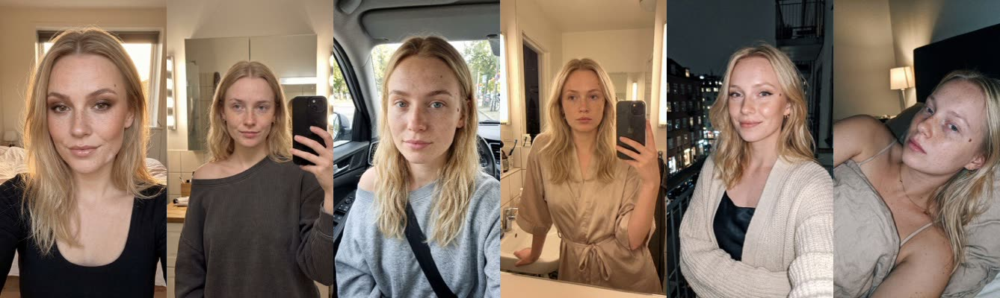
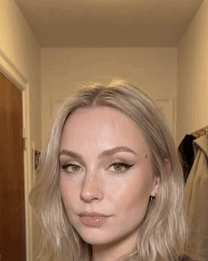

# ClipUGC CLI

Official command-line interface for **[ClipUGC](https://clipugc.com)** — create AI
influencers, generate photorealistic looks of the same person, turn them into
silent-reaction clips, and merge your app's screen recording into a ready-to-post
UGC ad. All from the terminal; nothing renders locally.

```bash
npm install -g clipugc
clipugc auth login
```

Requires **Node.js >= 20**. Create an API key in the
[ClipUGC dashboard](https://clipugc.com/dashboard) (API keys section).

## Use it with Claude Code

The fastest way in: this repo ships three Claude Code skills, so you describe what
you want instead of learning flags. `clipugc` drives the CLI conversationally,
`ugc-director` turns an app idea into a complete ad plan, and `persona-account`
runs an ongoing AI creator account.

```
/plugin marketplace add clipugc/ClipUGC-CLI
/plugin install clipugc@ClipUGC-CLI
```

Installed as a plugin, the skills are namespaced under it:

```
/clipugc:ugc-director make a TikTok ad for my habit tracker app
/clipugc:persona-account create an AI influencer for a fitness account
/clipugc:clipugc how many credits do I have left
```

(Cloning the repo instead? Claude Code reads `.claude/skills/` directly and the
skills are unprefixed — `/ugc-director`, `/persona-account`, `/clipugc`.)

See **[docs/skills.md](docs/skills.md)** for what each skill knows.

Prefer flags? Everything below works standalone — the skills just drive the same CLI.

## What it produces

One character, cast once. Every picture below is the **same person** — only the
setting, outfit and lighting change, because each look is generated from her base
image rather than from the description again:



```bash
clipugc characters create --wait \
  --description "Very pretty Danish woman aged 22, light blonde fine hair to her shoulders with a middle parting, pale blue upturned eyes, heart-shaped face, porcelain cool-toned skin. Genuinely attractive Instagram-creator look, but reads as a real girl — natural skin texture with visible pores, not airbrushed." \
  --scene "close selfie in a softly lit bedroom at golden hour, warm low sun through the window behind her giving a rim light on her hair, full glam makeup with smoky bronze eyeshadow and glossy nude lips, phone-camera quality with mild grain, slightly off-centre framing"

# every look after that: same face, new setting — never re-describe the person
clipugc images generate --character <id> --wait \
  --scene "bathroom mirror selfie in the evening, phone visible in her hand, warm vanity lights either side of the mirror, polished makeup with glowing skin and glossy lips, phone-camera quality with grain, slightly off-centre framing"
```

Then any look becomes a **silent reaction clip**. Mouth closed throughout — lip-sync
from a still image is the giveaway that a video is AI, so the format is a held
expression plus a text hook, not talking:



```bash
clipugc videos create --image <lookId> --duration 5 --wait \
  --prompt "She glances down at the phone, back up to the lens, and one corner of her mouth pulls into a smirk she is clearly trying to suppress. Her lips stay closed and together for the entire clip. She does not speak, does not mouth any words, and her mouth never opens. Natural handheld movement, she shifts slightly, hair moves. Ordinary phone-camera footage, visible grain."
```

Note the shape of that prompt: an **arc in beats** (glance down → back up → smirk
forms), an explicit no-talking clause, and ambient motion. Ask for a state instead
of a progression — "she smirks" — and the face morphs. The full library of ~30
reactions across nine emotion families lives in the
[`ugc-director`](docs/skills.md) skill.

Merging that clip with your screen recording and a hook is free, so the last step
costs nothing and you can test as many hooks as you like.

## How it works

| | Step | Cost |
|---|---|---|
| 1 | **Cast an AI character** — described in plain words; the server builds a structured appearance "DNA" and the first look | 2 credits |
| 2 | **Generate looks** — the same face in new settings, outfits and lighting | 2 credits each |
| 3 | **Animate a look** — a short silent reaction clip (mouth closed; lip-sync is what makes AI video look fake) | 7 (5s) / 13 (10s) |
| 4 | **Merge into an ad** — your screen recording + a hook text overlay + optional music | **free** |

Every look after the first is generated **from the character's base image**, so the
face stays the same person across an entire campaign or grid. That consistency is
the point of the product.

Full pricing: image 2 · clip 7 (5s) / 13 (10s) · motion control 3 per second of
driver video (capped at 30s) · scene-staged clip 9 (5s) / 15 (10s) · **merge free**.
Charges are duration-aware and refunds return the exact amount charged. Check live
values with `clipugc credits`.

## Quickstart (plain CLI)

```bash
# 1. Cast her. Be specific — this is what decides whether she looks like a real
#    creator or like generic AI. (See the casting guide for the formula.)
clipugc characters create --wait \
  --description "Very pretty Danish woman aged 22, light blonde fine hair to her shoulders with a middle parting, pale blue upturned eyes, heart-shaped face, porcelain cool-toned skin. Genuinely attractive Instagram-creator look, but reads as a real girl — natural skin texture with visible pores, not airbrushed." \
  --scene "close selfie in a softly lit bedroom at golden hour, warm rim light on her hair, full glam makeup with winged liner and glossy lips, natural skin texture, amateur front-camera phone quality, headroom above her head for text"

# 2. Animate the look into a 5s silent reaction.
clipugc videos create --image <lookId> --duration 5 --wait \
  --prompt "Handheld selfie framing, slight drift. Her expression gradually shifts from neutral to amazed — eyebrows rise, eyes widen, lips part slightly in a silent gasp — then she breaks into a delighted grin and holds it, looking straight into the camera. Hair moves subtly. No talking."

# 3. Merge your app recording under a hook. Free, so test as many hooks as you like.
clipugc videos merge <videoId> --app-video ./screenrec.mp4 --hook "nobody talks about this app" --wait

# 4. Download the finished ad — by AD id, not the clip id.
clipugc ads download <adId> -o ugc-ad.mp4
```

Add `--json` to any command for machine-readable output, and `--wait` to any
generation command to poll with a spinner until it completes.

## Example prompts

The prompt is the product. Below is one of each kind; the full libraries are in
[docs/casting.md](docs/casting.md) (9 nationalities) and the
[`ugc-director`](docs/skills.md) skill (~30 reactions across 9 emotion families).

**Casting** — concrete features → an explicit attractiveness claim → directed makeup
and lighting → a realism anchor. All four parts, or she comes out looking like AI:

<details>
<summary><b>Blonde Scandinavian</b> — the fastest way to see what this tool does</summary>

```bash
clipugc characters create --wait \
  --description "Very pretty Danish woman aged 22, light blonde fine hair to her shoulders with a middle parting and natural movement, pale blue upturned eyes, heart-shaped face, porcelain cool-toned skin, soft pink lips, gentle jawline. Calm, faintly teasing expression. Genuinely attractive Instagram-creator look, but reads as a real girl — natural skin texture with visible pores, not airbrushed." \
  --scene "close selfie in a softly lit bedroom at golden hour, warm low sun through the window behind her giving a rim light on her hair, full glam makeup with winged liner, long lashes and glossy lips, natural skin texture, amateur front-camera phone quality, headroom above her head for text"
```
</details>

<details>
<summary><b>Russian</b> — ash-blonde, high broad cheekbones, cool and reserved</summary>

```bash
clipugc characters create --wait \
  --description "Very pretty Russian woman aged 22 from Moscow, ash-blonde straight hair below her shoulders with a middle parting, cool grey-blue almond eyes set wide apart, high broad cheekbones, straight narrow nose, fair cool-toned skin, medium lips with a defined cupid's bow, fine straight brows. Reserved, slightly aloof expression that warms when she smiles. Strikingly attractive Instagram-creator look, yet unmistakably a real person — natural skin texture with visible pores, not airbrushed." \
  --scene "close selfie in a softly lit bedroom at golden hour, warm low sun behind her giving a rim light on her hair, soft glam makeup with winged liner and a nude glossy lip, natural skin texture, amateur front-camera phone quality, headroom above her head for text"
```
</details>

<details>
<summary><b>Ukrainian</b> — honey-brown, soft oval face, warm and open</summary>

```bash
clipugc characters create --wait \
  --description "Very pretty Ukrainian woman aged 21 from Kyiv, honey-brown hair with a soft natural wave past her shoulders, warm green eyes with a gentle upturn, soft oval face with a rounded chin, light golden-toned skin, full lips, softly arched brows, a small mole above her lip. Warm, open, easy-smiling energy. Genuinely attractive Instagram-creator look that reads as a real girl — natural skin texture with visible pores, not airbrushed." \
  --scene "front-camera phone selfie by a large window in a bright apartment, soft diffused daylight on her face, plants blurred behind, everyday makeup with fluffy brows and a glossy lip, natural skin texture, amateur phone quality, headroom above the head for text"
```
</details>

**Looks** — never re-describe the person; the base image carries the face. Change only
the setting, outfit and light:

```bash
clipugc images generate --character <id> --wait \
  --scene "mirror selfie in a bathroom in the evening, phone visible in her hand, warm vanity lights either side of the mirror, polished makeup with glowing skin and blush, natural skin texture, amateur phone quality, headroom above the head for text"

clipugc images generate --character <id> --wait \
  --scene "sitting in the driver's seat of a parked car in daylight, seatbelt on, daylight through the windscreen, natural skin texture, amateur phone quality, headroom above the head for text"
```

**Reactions** — an arc in beats, a held ending, ambient motion, and an explicit
no-talking clause every time:

<details>
<summary><b>Smirk</b> — "I know something you don't"</summary>

```
Handheld selfie framing with tiny natural wobble. She looks directly into the camera, one eyebrow raises slightly, a knowing smirk slowly spreads across her face, and she nods slowly twice, lips closed, holding eye contact the entire time. Hair moves subtly. No talking, mouth stays closed.
```
</details>

<details>
<summary><b>Jaw-drop</b> — the result reveal</summary>

```
Handheld selfie framing, slight drift. Her expression gradually shifts from neutral to amazed — eyebrows rise, eyes widen, lips part slightly in a silent gasp — then she breaks into a delighted grin and holds it, looking straight into the camera. Hair moves subtly. No talking.
```
</details>

<details>
<summary><b>Dreamy cheek-rest</b> — the soft beat a persona grid runs on</summary>

```
Nearly static selfie framing with subtle handheld drift. She rests her cheek against her palm, elbow anchored, eyes softening as a slow warm closed-mouth smile spreads, gaze drifting slightly off camera then returning to the lens, holding it. Hair moves subtly. No talking.
```
</details>

<details>
<summary><b>Head-shake</b> — "why did nobody tell me"</summary>

```
Handheld selfie framing, slight wobble. She exhales through her nose, shakes her head slowly with a rueful closed-mouth smile, briefly glances up at the ceiling, then back into the camera with an amused resigned look, holding it. Hair follows the motion naturally. No talking.
```
</details>

**Hooks** — the text burned over the clip. Re-merging is free, so ship 2-3 variants of
every ad and let the platform pick:

```
nobody talks about this app
why did nobody tell me
I stopped paying for 4 apps
POV: you finally organised your week
```

## Documentation

| Guide | What's in it |
|---|---|
| **[Casting prompts](docs/casting.md)** | The four-part formula behind a good-looking influencer, plus ready-made castings — Scandinavian, Californian, Mediterranean, Korean, Russian, Ukrainian, Polish, Moldovan, Czech |
| **[Promoting your app](docs/promoting-your-app.md)** | The end-to-end ad walkthrough, hook A/B testing, and who to cast for which app category |
| **[Command reference](docs/commands.md)** | Every command and flag, with credit costs |
| **[Configuration](docs/configuration.md)** | Config file, environment variables, exit codes |
| **[Claude Code skills](docs/skills.md)** | Drive all of this in natural language instead of by flag |

## Local development

```bash
npm ci
npm run build     # compile TypeScript to dist/
npm test          # run the vitest suite
npm run dev       # run from source (tsx src/index.ts)
```

## License

MIT
